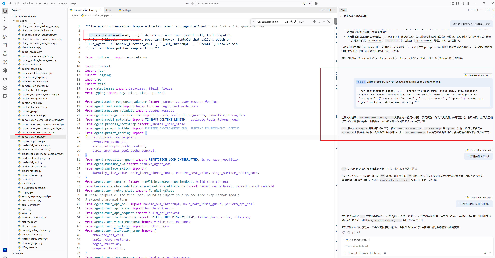

# Day 001：LLM 基础——Token

## 🎯 今日目标


## 📚 今日学习
### 1、Hermes的CLI中hermes_cli/main.py是入口吗？

如果你指的是 hermes_cli/main.py，可以把它理解成 Hermes 的 CLI（命令行客户端）入口。

但这里要区分两个概念：
```text
用户在终端执行命令
        │
        ▼
hermes_cli/main.py       ← CLI 入口
        │
        ▼
解析命令行参数 / 初始化
        │
        ▼
AIAgent
        │
        ▼
run_conversation()
        │
        ▼
Agent Loop
        │
        ▼
LLM ↔ Tool ↔ Context ...
```
关键点 :hermes_cli/main.py 不是 Agent Loop 本身。它更像 Java 世界里的：
```java
public static void main(String[] args) {
    // 解析启动参数
    // 创建应用
    // 启动应用
}
```
而我们真正想研究的“AI 核心”是后面的：
```text
hermes_cli/main.py
        ↓
AIAgent
        ↓
run_conversation()
        ↓
conversation_loop.py
        ↓
LLM
```
所以你现在可以形成一个非常重要的源码阅读习惯：
>入口 ≠ 核心逻辑。
入口负责“把程序启动起来”，核心逻辑负责“程序真正干什么”。

和 tinystruct 对照就更清楚了
```text
Hermes                         tinystruct
─────────────────────          ─────────────────────

CLI 命令                       CLI 命令
   │                              │
   ▼                              ▼
hermes_cli/main.py              dispatcher
   │                              │
   ▼                              ▼
AIAgent                         Application
   │                              │
   ▼                              ▼
Agent Loop                      @Action
   │                              │
   ▼                              ▼
LLM / Tools                    Java Method
```

所以我们接下来第一刀就可以切 hermes_cli/main.py：
```text
① 谁调用 main？
② main 做了什么？
③ 怎么创建 AIAgent？
④ 用户输入从哪里进入？
⑤ 从哪个方法开始进入 Agent Loop？
```
然后再顺着调用链进入 conversation_loop.py。
这会非常像我以前作为 Java 程序员排查一个项目：
```text
main()
 ↓
Controller
 ↓
Service
 ↓
核心业务
```
只不过 Hermes 是：
```text
CLI Entry
 ↓
AIAgent
 ↓
Agent Loop
 ↓
LLM
 ↓
Tool
```


### 2、一个用户输入的字符串，到底是怎么一步一步变成 LLM API 的 messages 的？
这个问题一旦追通，这些概念：
> Token、Message、System/User/Assistant、Prompt、Context Window、LLM API

会一下子串起来。
所以我们下一轮就直接从 Hermes AIAgent.run_conversation() → agent/conversation_loop.py 开始，一行一行追第一条 Agent Loop。官方当前文档也明确把 run_conversation() 指向这里，并给出了它的实际生命周期。
参考地址：https://github.com/NousResearch/hermes-agent/blob/main/website/docs/developer-guide/agent-loop.md?utm_source=chatgpt.com

#### 1. 我们今天只追这一条链
先把问题缩小：
> 用户输入 "你好"，到底是怎么变成发送给 LLM 的 messages 的？

最终我们希望看到：
```text
用户输入
   │
   ▼
"你好"
   │
   ▼
user_message
   │
   ▼
{"role": "user", "content": "你好"}
   │
   ▼
conversation history
   │
   ▼
system prompt + history
   │
   ▼
api_messages
   │
   ▼
LLM API

```
而这条链正好会把：

+ Message
+ System / User / Assistant
+ Prompt
+ Context
+ Context Window
+ Token

全部串起来。


#### 2. 第一件事：用户输入在哪里？
我们先不要急着进入 conversation_loop.py。
从项目结构来看，当前 Hermes 把 CLI 编排放在：
```jupyter
cli.py
hermes_cli/
```


而官方贡献指南现在明确把：
```jupyter
cli.py
```
描述为：
> HermesCLI class — interactive CLI orchestrator 翻译成中文：HermesCLI 类 — 交互式 CLI 编排器

同时：
```jupyter
run_agent.py
```
是：
> AIAgent facade  AI 代理的门面，就像Java设计模式中的fecade一样的意思

然而：
```jupyter
agent/conversation_loop.py
```
才是：
> run_conversation() — the agent turn loop 才是智能体多轮次循环执行的地方

所以我们现在应该调整之前的地图：
```text
                    CLI
                     │
                     ▼
                HermesCLI
                     │
                     ▼
                  AIAgent
                     │
                     ▼
             run_conversation()
                     │
                     ▼
          agent/conversation_loop.py
                     │
                     ▼
                LLM API
```

#### 3. 真正重要的地方：run_conversation()
现在进入：
> agent/conversation_loop.py

这个文件目前已经有 1807 行，说明 Hermes 把 Agent Loop 做得非常复杂了。官方源码顶部也直接说明：

run_conversation(agent, ...)

负责：

```text
model call
tool dispatch
retries
fallbacks
compression
post-turn hooks
```

但我们绝对不要从第一行开始读 1800 行。

这是源码学习的大忌。

我们只找：
```text
def run_conversation(...)
```



然后围绕这个方法建立调用链。


#### 4. 第一个非常关键的事实
官方当前 Agent Loop 文档直接给出了一个 turn【轮次】 的生命周期：
```text
run_conversation()

    ↓

1. Generate task_id 生成任务编号

    ↓

2. Append user message 追加用户消息

    ↓

3. Build / reuse system prompt

    ↓

4. Check context compression 检查上下文压缩情况

    ↓

5. Build API messages

    ↓

6. Inject temporary prompt layers 注入临时提示曾

    ↓

7. API call 调用API

    ↓

8. Parse response 解析响应的结果

    ↓

    ┌──────────────┐
    │              │
    ▼              ▼
tool_calls       text
    │              │
    ▼              ▼
执行 Tool        返回答案
    │
    ▼
tool result
    │
    └──────→ 再次进入 Loop
```

这就是我们今天真正要理解的 Agent Loop。

#### 5. 现在回答第一个问题：用户字符串什么时候变成 Message？
这里是非常关键的一步。Hermes 内部维护的是 OpenAI-compatible message format【兼容OpenAI消息格式】。官方文档明确说明：
```json
{
  "role": "system",
  "content": "..."
}
```
以及完整的消息角色：
```text
system
user
assistant
tool
```
所以，用户输入：
```text
你好
```
进入 Agent 后，并不是直接："你好"。而是直接传给模型，然后这句话被放到JSON格式报文中：
```json
{
  "role": "user",
  "content": "你好"
}
```
#### 6. 这就是我们第一个基础概念：Message
Message 是什么？
你可以把 Message 理解成：
> 一条带有身份信息的对话记录。

比如：
```json
{
  "role": "user",
  "content": "你好"
}
```
解释如下：
```text
role
  ↓
谁说的？

content
  ↓
说了什么？
```
所以我们可以推测出这样的结构：
```text
用户说：
{"role": "user", "content": "你好"}

AI说：
{"role": "assistant", "content": "你好！"}

系统说：
{"role": "system", "content": "You are an AI assistant."}
```

#### 7. 所以 System / User / Assistant 到底是什么？

现在我们应该能看到：
```text
System 系统
User 用户
Assistant 助手
```
并不是三个不同的模型。也不是三个不同的 API。而是：
```text
Message 的 role。
```

举个例子：
```json
[
  {
    "role": "system",
    "content": "You are Hermes."
  },
  {
    "role": "user",
    "content": "你好"
  },
  {
    "role": "assistant",
    "content": "你好，有什么可以帮你？"
  }
]
```
把这个报文中所有的message合并起来得到的整个东西：
```text
[
  Message,
  Message,
  Message
]
```
这就是conversation history，中文就是对话历史消息

#### 8. 这时候 Context 就出现了
假设用户连续说：
```text
User:
你好

Assistant:
你好！

User:
我是一名 Java 程序员

Assistant:
很高兴认识你。

User:
我现在想学习 AI
```
那么发送给模型的可能不是最后一句：
```text
我现在想学习 AI
```

而是：
```json
[
  {
    "role": "system",
    "content": "..."
  },
  {
    "role": "user",
    "content": "你好"
  },
  {
    "role": "assistant",
    "content": "你好！"
  },
  {
    "role": "user",
    "content": "我是一名 Java 程序员"
  },
  {
    "role": "assistant",
    "content": "很高兴认识你。"
  },
  {
    "role": "user",
    "content": "我现在想学习 AI"
  }
]
```
这一整个 Message 列表，就是我们现在要重点研究的 Context 的核心组成部分。

#### 9. 但是事情还没完
你可能会马上问：
```text
那 System Prompt 在哪里？
```
这正是下一层。
Hermes 的 Agent Loop 会：
```text
用户输入
    │
    ▼
conversation history
    │
    ├───────────────┐
    │               │
    ▼               ▼
User Message    System Prompt
    │               │
    └───────┬───────┘
            ▼
      API Messages
            │
            ▼
          LLM
```

而 System Prompt 并不是简单写死一句：
```text
You are an AI.
```
Hermes 有专门的：
```text
agent/prompt_builder.py
```
负责组装 system prompt。官方文档明确把 prompt_builder.py 定义为：
```text
System prompt assembly from memory, skills, context files, personality
从记忆、技能、上下文文件和个性中组装系统提示。
```
也就是说，System Prompt 本身可能来自多个部分。
参考文档：
```text
https://github.com/NousResearch/hermes-agent/blob/main/website/docs/developer-guide/agent-loop.md?utm_source=chatgpt.com
```

#### 10. 这就产生了一个非常重要的认知

以前我们容易把：Prompt理解成：
```text
用户输入的问题
```
其实不准确。在 Agent 系统里面：
```text
Prompt=System Prompt+Conversation History+Current User Message+
Tool Information+可能的额外 Context
```
最终才形成真正发送给模型的输入。可以画成：
```text
                 Prompt
                    │
        ┌───────────┼───────────┐
        │           │           │
        ▼           ▼           ▼
     System      History      User
     Prompt                    Message
        │           │           │
        └───────────┼───────────┘
                    │
                    ▼
              API Messages
                    │
                    ▼
                   LLM
```
**这个概念非常重要。**

因为以后我们看到：
```text
Prompt Engineering  提示词工程
Prompt Template     提示模板
System Prompt       系统提示
RAG Prompt          检索增强生成的提示
Agent Prompt        代理提示
```
都会回到这里。

#### 11. 然后就是 Context Window

现在假设：
```text
System Prompt
    5,000 tokens

Conversation History
   30,000 tokens

User Message
    1,000 tokens

Tools
    8,000 tokens
```
那么：
```text
总输入 ≈ 44,000 tokens
```
如果模型 Context Window：
```text
32K
```
就爆了，超出上限了。
所以 Hermes 为什么需要：
```text
context compression
```
就很好理解了。它不是为了“优化代码”。而是因为：
> LLM 每次请求能够处理的 Token 数量存在上限。

官方当前实现会在模型调用前检查上下文压力，并在超过阈值时进行 compression；文档描述的默认流程包括压缩中间轮次、
保留最近若干消息、保持 tool call/result配对等操作。
#### 12. 现在我们终于可以回答最初的问题了
> 一个用户输入的字符串，到底是怎么一步一步变成 LLM API 的 messages 的？

当前源码结构下，可以先得到这张准确的概念地图：
```text
用户输入
   │
   │ "我想学习 AI"
   ▼
user_message
   │
   ▼
┌─────────────────────────────┐
│ Conversation History        │
│                             │
│ system                      │
│ user                        │
│ assistant                   │
│ user                        │
│ assistant                   │
│ ...                         │
│                             │
│ + 当前 user message         │
└──────────────┬──────────────┘
               │
               │
               ▼
       Context / Compression
               │
               ▼
       System Prompt Builder
               │
               ▼
       Prompt + Messages
               │
               ▼
          API Messages
               │
               ▼
             LLM
```

而 Hermes 当前的 Agent Loop 文档把第 5 步明确描述为：
> Build API messages from conversation history
> 根据对话历史构建 API 消息

不同 provider 再根据 API 类型转换：
```text
OpenAI Chat Completions
        ↓
保持 OpenAI message format

Codex Responses
        ↓
转换成 Responses API input items

Anthropic Messages
        ↓
通过 adapter 转换
```

#### 13. 我们今天实际上已经“倒逼”出了 5 个基础概念
这就是我们这套学习方式的价值。没有死记硬背，我们从源码自然得到了：
```text
① Message
      ↓
{"role": "...", "content": "..."}

② System / User / Assistant
      ↓
Message 的 role

③ Conversation History
      ↓
多个 Message

④ Prompt
      ↓
System + History + User + Tools + Context ...

⑤ Context Window
      ↓
这些内容最终都会消耗 Token
```
然后自然就到了我们的第一个基础知识链：
```text
Message
   ↓
Prompt
   ↓
Context
   ↓
Token
   ↓
Context Window
```

#### 14. 但还有一个关键问题没有解决
现在我们知道：
```text
api_messages
     ↓
LLM
```
但是：
> Hermes 到底在哪里真正执行这一句？

类似：
```jupyter
client.chat.completions.create(
    model=...,
    messages=...,
    tools=...
)
```
官方 agent/AGENTS.md 已经明确给出了当前 loop 的核心调用形式，并指出 API 调用是在 loop 中执行，
然后如果模型返回 tool_calls，就执行工具、追加 tool result，再重新进入 loop。
所以我们的下一刀就非常明确：
```text
conversation_loop.py
        │
        ▼
turn_request_assembly.py
        │
        ▼
turn_api_request.py
        │
        ▼
turn_api_call.py
        │
        ▼
client.chat.completions.create(...)
```

下一步我们就追这一段。这一步追通之后，我们会第一次真正看到：
```jupyter
messages=...
```
然后我会把源码中的 messages 和我们刚才画出来的：
```text
[
  {"role": "system", ...},
  {"role": "user", ...},
  {"role": "assistant", ...}
]
```

一一对应起来。到那时，“Prompt 到底是什么”就不再是概念，而是你亲眼看到的运行时数据结构。

继续沿着 Hermes 这条真实调用链往下追一层。
我们现在已经走到了：
```text
用户输入
   ↓
Message
   ↓
Conversation History
   ↓
Prompt / Context
   ↓
API Messages
   ↓
？？？
```
这里正好缺最关键的一环：
> 下一步：追到真正的 LLM API 调用

我们要回答：
> messages 最终是怎么传给模型的？

重点追这条链：
```text
conversation_loop.py
        ↓
turn_request_assembly.py
        ↓
turn_api_request.py
        ↓
turn_api_call.py
        ↓
LLM Provider
        ↓
OpenAI / Anthropic / 其他模型 API
```
然后我们亲眼看到类似这样的东西：
```jupyter
response = client.chat.completions.create(
    model=model,
    messages=messages,
    tools=tools,
    temperature=temperature,
    stream=True
)
```
这时候我们就会一下子遇到 5 个核心概念：
```terminaloutput
| 源码里的东西        | 我们倒逼学习的概念                  |
| ------------- | -------------------------- |
| `messages`    | Message / Prompt / Context |
| `model`       | Model / Provider           |
| `temperature` | Temperature                |
| `tools`       | Tool Calling               |
| `stream`      | Streaming                  |

```
这比现在单独开一章讲 Temperature、Streaming 更有价值，因为你会看到它们为什么存在、在哪里传、最终传给谁。


**然后再进入第二条线：tinystruct**

等 Hermes 这一段追通：
```text
User
 ↓
Message
 ↓
Prompt
 ↓
Context
 ↓
LLM API
```
我们再切到 tinystruct：
```text
dispatcher
   ↓
AbstractApplication
   ↓
@Action
   ↓
Java Method
```
然后问一个非常有意思的问题：
> 如果 Hermes 的 LLM 说：“我要调用一个工具”，Java 世界里的这个工具到底怎么落地？

于是两条线就会开始汇合：
```text
                Hermes
                  │
                  ▼
                 LLM
                  │
             Tool Calling
                  │
                  ▼
              Tool Schema
                  │
                  ▼
             Tool Executor
                  │
                  ▼
          ┌───────────────┐
          │ Java 世界      │
          │               │
          │ tinystruct    │
          │      ↓        │
          │   @Action     │
          │      ↓        │
          │ Java Method   │
          └───────────────┘
```

这会是我们第一次真正理解：
> AI Agent 是怎么调用 Java 业务能力的。

**所以我们的学习路线暂时调整成这样**
```text
                 现在
                   │
                   ▼
        ① Hermes Agent Loop
                   │
                   ▼
        ② 真正的 LLM API Call  ← 下一步
                   │
        ┌──────────┼──────────┐
        ▼          ▼          ▼
      Token    Temperature  Streaming
                   │
                   ▼
        ③ Tool Calling
                   │
                   ▼
        ④ tinystruct @Action
                   │
                   ▼
        ⑤ AI → Java Method
                   │
                   ▼
        ⑥ Embedding / Vector
                   │
                   ▼
        ⑦ RAG / Memory
                   │
                   ▼
        ⑧ MCP
                   │
                   ▼
        完整 AI Agent
```
直接打开 Hermes 的 turn_api_call.py，追它到底调用了哪个 Provider / Client。

我们的目标不是“看懂整个文件”，而是只回答三个问题：
> messages 是怎么传进去的？
> 
> model / temperature / stream 是怎么传进去的？
> 
> 最终是哪一个 Python 方法真正发出了 HTTP/API 请求？

把这三个问题追通，我的LLM API 调用模型 就真正建立起来了。
然后我们再回头看 tinystruct，会非常顺。

现在我们已经把这条链真正追到了“发请求”的边界。
先给你一个非常重要的结论：
> Hermes 并不是在 conversation_loop.py 里直接写死 client.chat.completions.create(...)。
> 当前版本已经把“组装请求”和“执行请求”进一步拆开了。

这正好非常适合我们学习 AI 应用工程。

### 一、先把今天的完整链路画出来
我们现在追的是：
```text

用户输入
   ↓
conversation_loop.py
   ↓
build_api_messages()
   ↓
assemble_api_request()
   ↓
build_api_request()
   ↓
_build_api_kwargs()
   ↓
api_kwargs
   ↓
perform_api_call()
   ↓
relay_llm / transport / client
   ↓
LLM Provider
```

官方 Agent Loop 文档也明确把这个过程拆成：
```text
run_conversation()
    ↓
Build API messages
    ↓
Inject prompt layers
    ↓
Make API call
    ↓
Parse response
```
而且 Hermes 内部统一使用 OpenAI 风格的 Message：
```json
{
  "role": "system",
  "content": "..."
}
```
```json
{
  "role": "user",
  "content": "你好"
}
```
```json
{
  "role": "assistant",
  "content": "你好，有什么可以帮你？"
}
```
工具调用时还会出现：
```json
{
  "role": "assistant",
  "tool_calls": [...]
}
```
以及：
```json
{
  "role": "tool",
  "tool_call_id": "...",
  "content": "..."
}
```

### 二、问题 1：messages 到底是怎么传给模型的？
#### 1. messages 不是直接拿来发送的

在 turn_request_assembly.py 中：
```text
api_messages, effective_system = build_api_messages(
    agent,
    messages,
    current_turn_user_idx=current_turn_user_idx,
    ext_prefetch_cache=_ext_prefetch_cache,
    plugin_user_context=_plugin_user_context,
    moa_config=moa_config,
    active_system_prompt=active_system_prompt,
)
```
也就是说：
```text
messages
   ↓
build_api_messages()
   ↓
api_messages
```
注意这里出现了一个非常值得你记住的概念：
> messages ≠ api_messages

#### 2. 为什么要复制一份？
因为 Hermes 的：
```text
messages
```
更像是：
> Agent 内部维护的会话状态

而：
```text
api_messages
```
更像是：

准备发送给模型的 Wire Payload

也就是：
```text
内部状态
↓
转换 / 清理 / 压缩 / 修改
↓
API 请求数据
```


这个设计非常像 Java 后端：
```text
Entity
↓
Service
↓
DTO
↓
HTTP Request
```


你可以直接把它理解成：
```text
Agent Message
↓
API Message
↓
HTTP Request
```


这就是我们以后写 AI Java 应用时非常重要的一个工程思想。


### 三、api_messages 还会经历什么？
这里就开始有意思了。
Hermes 并不是：
```text
api_messages = messages
client.send(api_messages)
```

而是继续进行大量处理。例如：
```text
api_messages = agent._sanitize_api_messages(api_messages)

```


## 💡 核心概念
```text
Prompt Engineering  提示词工程
Prompt Template     提示模板
System Prompt       系统提示
RAG Prompt          检索增强生成的提示
Agent Prompt        代理提示
```

```terminaloutput
| 源码里的东西        | 我们倒逼学习的概念                  |
| ------------- | -------------------------- |
| `messages`    | Message / Prompt / Context |
| `model`       | Model / Provider           |
| `temperature` | Temperature                |
| `tools`       | Tool Calling               |
| `stream`      | Streaming                  |

```

## 💻 代码实践

## 🧠 我的理解

## ❓ 遇到的问题


## 📝 今日总结

## 🔗 参考资料