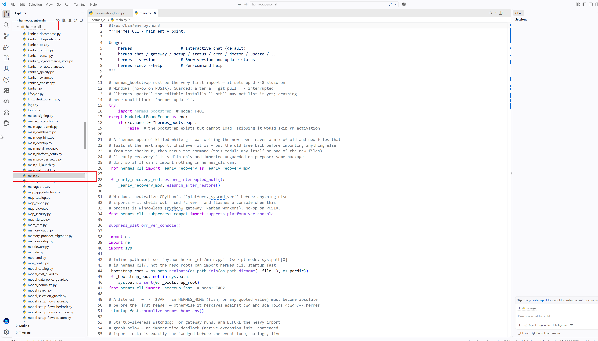
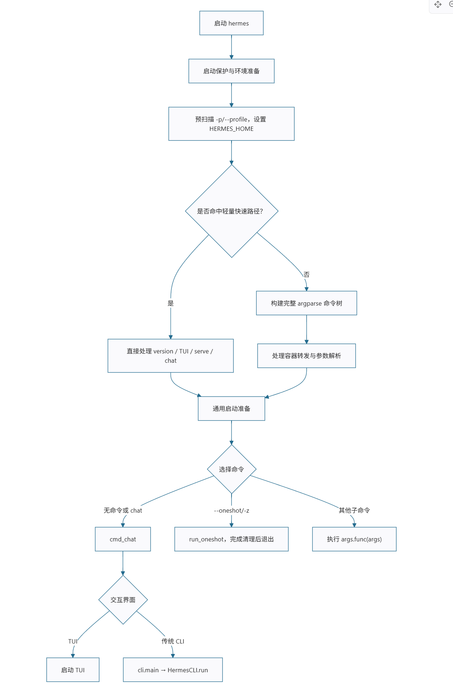
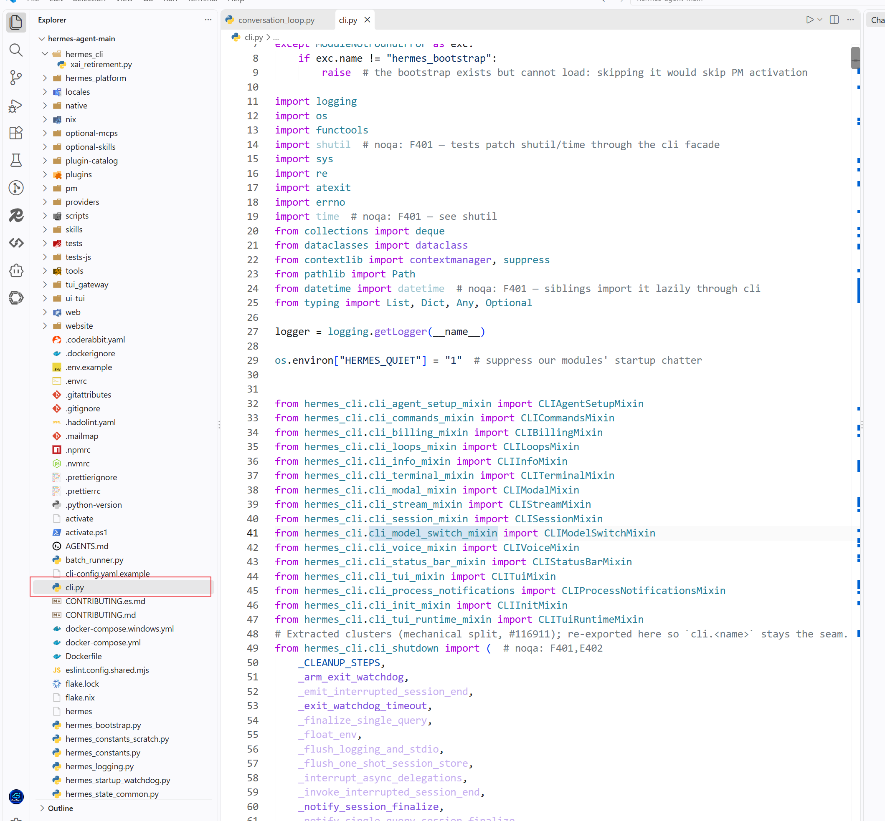

# Day 001：LLM 基础——Token

## 🎯 今日目标


## 📚 今日学习
### 1、Hermes的CLI中hermes_cli/main.py是入口吗？

如果你指的是 hermes_cli/main.py，可以把它理解成 Hermes 的 CLI（命令行客户端）入口。

但这里要区分两个概念：
```text
用户在终端执行命令
        │
        ▼
hermes_cli/main.py       ← CLI 入口
        │
        ▼
解析命令行参数 / 初始化
        │
        ▼
AIAgent
        │
        ▼
run_conversation()
        │
        ▼
Agent Loop
        │
        ▼
LLM ↔ Tool ↔ Context ...
```
关键点 :hermes_cli/main.py 不是 Agent Loop 本身。它更像 Java 世界里的：
```java
public static void main(String[] args) {
    // 解析启动参数
    // 创建应用
    // 启动应用
}
```
而我们真正想研究的“AI 核心”是后面的：
```text
hermes_cli/main.py
        ↓
AIAgent
        ↓
run_conversation()
        ↓
conversation_loop.py
        ↓
LLM
```
所以你现在可以形成一个非常重要的源码阅读习惯：
>入口 ≠ 核心逻辑。
入口负责“把程序启动起来”，核心逻辑负责“程序真正干什么”。

和 tinystruct 对照就更清楚了
```text
Hermes                         tinystruct
─────────────────────          ─────────────────────

CLI 命令                       CLI 命令
   │                              │
   ▼                              ▼
hermes_cli/main.py              dispatcher
   │                              │
   ▼                              ▼
AIAgent                         Application
   │                              │
   ▼                              ▼
Agent Loop                      @Action
   │                              │
   ▼                              ▼
LLM / Tools                    Java Method
```

所以我们接下来第一刀就可以切 hermes_cli/main.py：
```text
① 谁调用 main？
② main 做了什么？
③ 怎么创建 AIAgent？
④ 用户输入从哪里进入？
⑤ 从哪个方法开始进入 Agent Loop？
```
然后再顺着调用链进入 conversation_loop.py。
这会非常像我以前作为 Java 程序员排查一个项目：
```text
main()
 ↓
Controller
 ↓
Service
 ↓
核心业务
```
只不过 Hermes 是：
```text
CLI Entry
 ↓
AIAgent
 ↓
Agent Loop
 ↓
LLM
 ↓
Tool
```


### 2、一个用户输入的字符串，到底是怎么一步一步变成 LLM API 的 messages 的？
这个问题一旦追通，这些概念：
> Token、Message、System/User/Assistant、Prompt、Context Window、LLM API

会一下子串起来。
所以我们下一轮就直接从 Hermes AIAgent.run_conversation() → agent/conversation_loop.py 开始，一行一行追第一条 Agent Loop。官方当前文档也明确把 run_conversation() 指向这里，并给出了它的实际生命周期。
参考地址：https://github.com/NousResearch/hermes-agent/blob/main/website/docs/developer-guide/agent-loop.md?utm_source=chatgpt.com

#### 1. 我们今天只追这一条链
先把问题缩小：
> 用户输入 "你好"，到底是怎么变成发送给 LLM 的 messages 的？

最终我们希望看到：
```text
用户输入
   │
   ▼
"你好"
   │
   ▼
user_message
   │
   ▼
{"role": "user", "content": "你好"}
   │
   ▼
conversation history
   │
   ▼
system prompt + history
   │
   ▼
api_messages
   │
   ▼
LLM API

```
而这条链正好会把：

+ Message
+ System / User / Assistant
+ Prompt
+ Context
+ Context Window
+ Token

全部串起来。


#### 2. 第一件事：用户输入在哪里？
我们先不要急着进入 conversation_loop.py。
从项目结构来看，当前 Hermes 把 CLI 编排放在：
```jupyter
cli.py
hermes_cli/
```


而官方贡献指南现在明确把：
```jupyter
cli.py
```
描述为：
> HermesCLI class — interactive CLI orchestrator 翻译成中文：HermesCLI 类 — 交互式 CLI 编排器

同时：
```jupyter
run_agent.py
```
是：
> AIAgent facade  AI 代理的门面，就像Java设计模式中的fecade一样的意思

然而：
```jupyter
agent/conversation_loop.py
```
才是：
> run_conversation() — the agent turn loop 才是智能体多轮次循环执行的地方

所以我们现在应该调整之前的地图：
```text
                    CLI
                     │
                     ▼
                HermesCLI
                     │
                     ▼
                  AIAgent
                     │
                     ▼
             run_conversation()
                     │
                     ▼
          agent/conversation_loop.py
                     │
                     ▼
                LLM API
```


## 💡 核心概念

## 💻 代码实践

## 🧠 我的理解

## ❓ 遇到的问题


## 📝 今日总结

## 🔗 参考资料