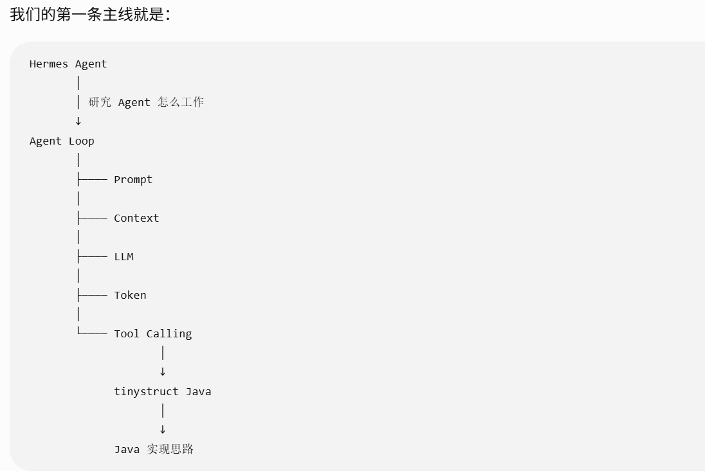
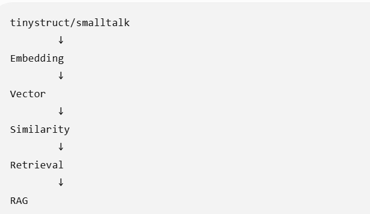
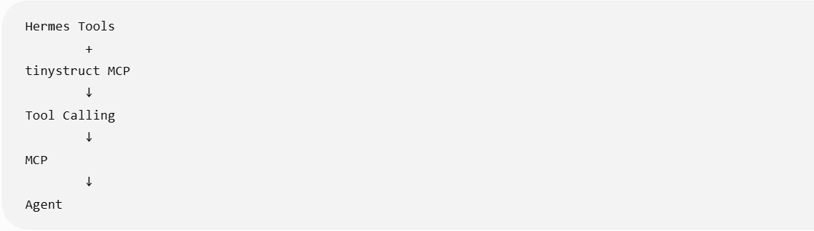

## 学习方法
通过采用这种方式：
一个概念->一个生活类比->一个技术原理->一个API示例->一个小练习
的方式来将核心概念串起来

## 目标概念
1. Token 令牌 大模型到底是怎么“读文字”的
2. Context Window 上下文窗口 大模型一次能看到多少内容
3. Prompt 提示词 怎么给模型下指令
4. System/User/Assistant 一次对话到底由什么组成
5. Temperature 温度参数 为什么同一个问题可能得到不同的答案
6. Stream 流式输出 为什么ChatGPT的字会一个个出现
7. Embedding 嵌入 怎么把文字变成机器可以比较的向量
8. Vector/Similarity 向量/相似度 AI大模型怎么判断“两段文字是不是相似”
9. Function Calling/Tool Calling 函数调用/工具调用 AI大模型怎么调用外部的工具，比如你应用中Java方法
10. Structured Output 结构化输出 怎么让AI稳定返回JSON格式的报文信息
11. Multimodal 多模态 AI大模型怎么同时理解文字、图片、音频等数据
12. Fine-tuning 微调 什么情况下需要训练/微调模型
13. RAG 检索增强生成 AI怎么回答自己的知识库
14. 综合实践 用Java调用大模型的API做个一个AI应用

## 这样一来，我上面的 14 个基础概念都有“落脚点”
我们甚至可以建立一张地图：

| 基础概念                  | Hermes             | tinystruct 方向  | 我们要回答的问题                           |
| ------------------------- | ------------------ | --------------- | ------------------------------------------ |
| Token                     | Context / Provider | LLM API         | Token 到底在哪里产生？                     |
| Context Window            | Context Engine     | Chat / RAG      | 为什么上下文会爆？                         |
| Prompt                    | Prompt Builder     | Chat            | Prompt 到底怎么组装？                      |
| System/User/Assistant     | Agent Loop         | Chat            | Message 到底是什么？                       |
| Temperature               | Provider           | LLM 调用        | 参数怎么传给模型？                         |
| Streaming                 | Agent/UI           | Chat/Web        | 为什么答案能流式输出？                     |
| Embedding                 | Memory/Retrieval   | smalltalk       | 为什么文字能变成向量？                     |
| Vector                    | Retrieval          | smalltalk       | Vector 到底存什么？                        |
| Similarity                | Search             | smalltalk       | 怎么找到相关文档？                         |
| Tool Calling              | Tools              | tinystruct/MCP  | AI 怎么调用 Java 方法？                    |
| Structured Output         | Tool schema        | Java Object     | AI 怎么返回可靠 JSON？                     |
| Multimodal                | Vision/Voice       | Chat            | 图片/音频怎么进入模型？                    |
| Fine-tuning               | Provider/Model     | —               | 微调和 RAG 到底区别在哪？                   |
| RAG                       | Memory/Retrieval   | smalltalk       | 检索结果怎么进入 Prompt？                   |ry/Retrieval   | smalltalk       | 检索结果怎么进入 Prompt？                   |

我们的第一条主线就是：

然后第二条：

第三条：

